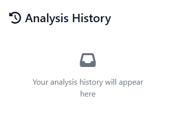
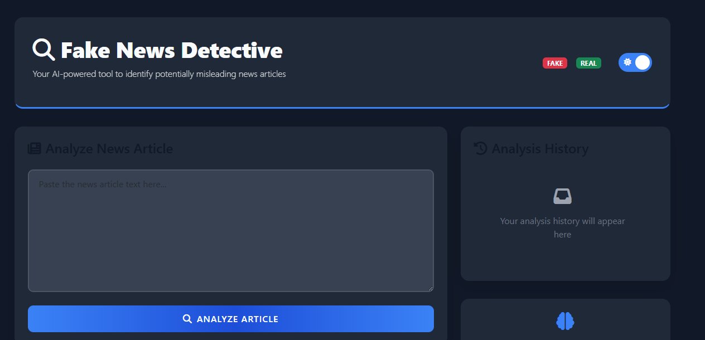
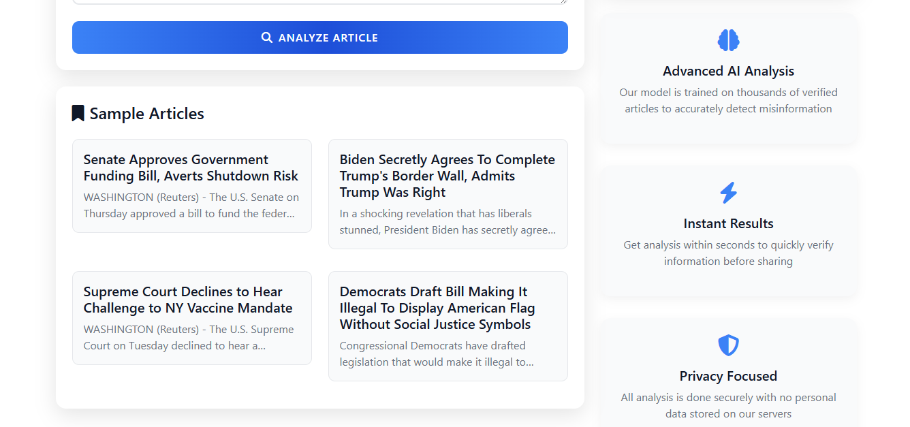
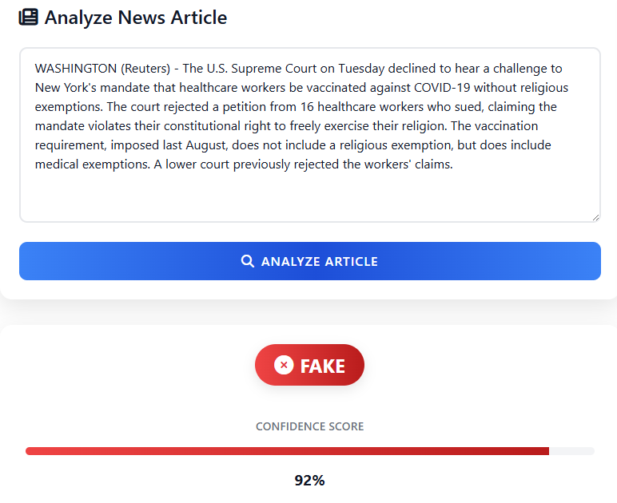
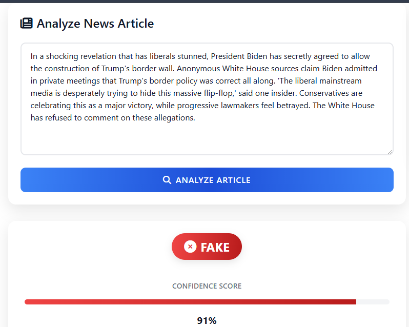
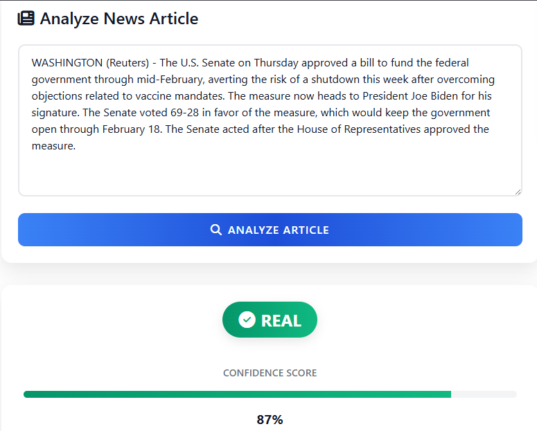
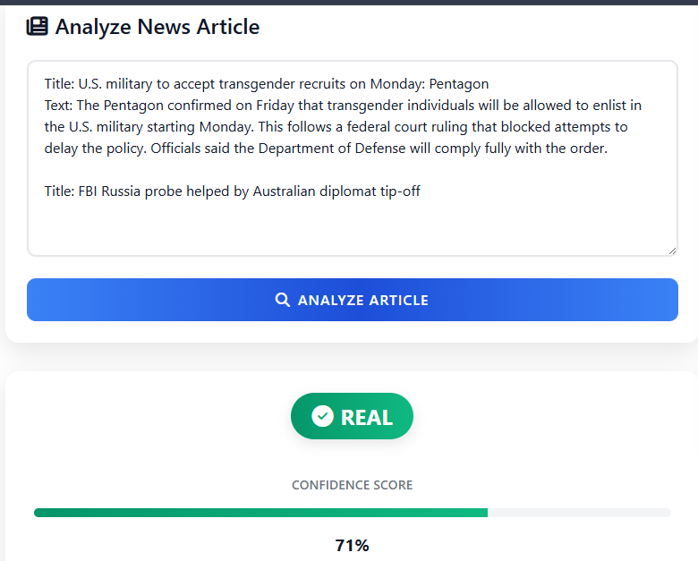
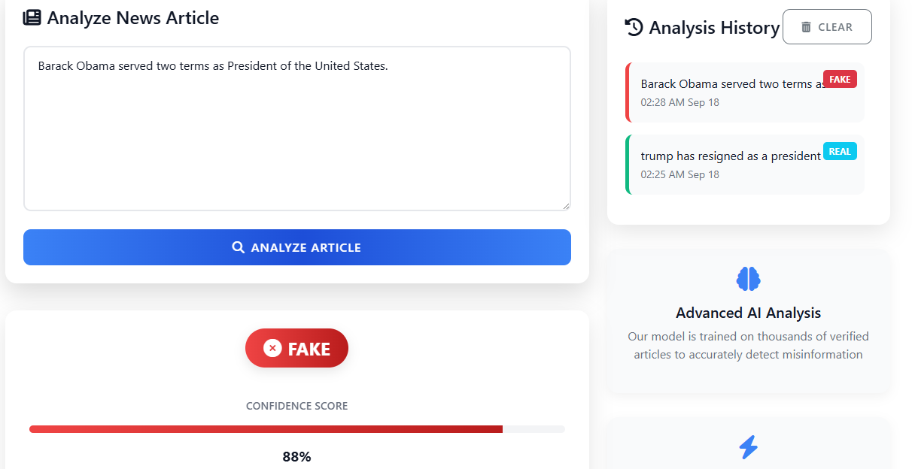

# AI Fake News Detector  

A web application that uses **Machine Learning** and **Natural Language Processing (NLP)** to classify news articles as **True** or **Fake**.  

> **Note:** This model is primarily trained on **US political news**. Results may be less reliable for other topics. Always cross-reference with trusted sources.

---

## 📸 Demo / Screenshots  

  
*Cleared history box (no recent searches).*

  
*Home page – dark theme.*

  
*Home page – dark theme (alternate view).*

  
*Home page – light theme.*

  
*Home page – light theme (alternate view).*

  
*Search history box with previous checks.*

  
*Sample articles displayed for quick testing.*

  
*Theme toggle button.*

**Prediction Examples:**  
  
  
  
  
  

---

## 🚀 Features  
- Detects whether a news headline/article is **True** or **Fake**  
- Dark/Light theme toggle  
- Search history box with clear option  
- Simple and interactive web interface  
- Uses pre-trained **ML/NLP models** for classification  

---

## 🛠 Tech Stack  
- **Frontend:** HTML, CSS, JavaScript (Flask templates)  
- **Backend:** Python (Flask)  
- **ML/NLP:** PyTorch, scikit-learn, spaCy, NLTK  
- **Other Tools:** Pandas, NumPy, Matplotlib  

---

## ⚙️ Installation  

1. **Clone this repository:**  
   ```bash
   git clone https://github.com/MeerabAfzal/ai_fake_news_detector.git
   cd ai_fake_news_detector/ai_new_test
